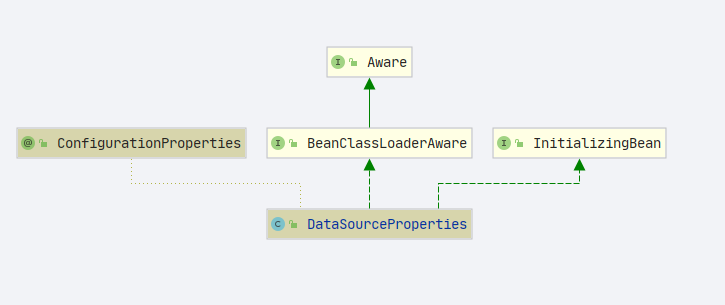
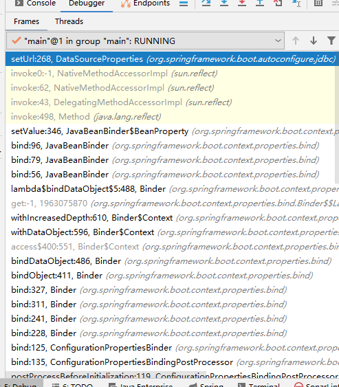
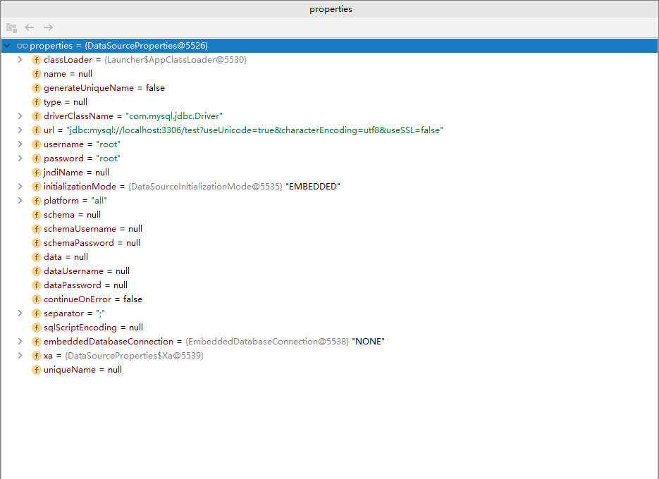
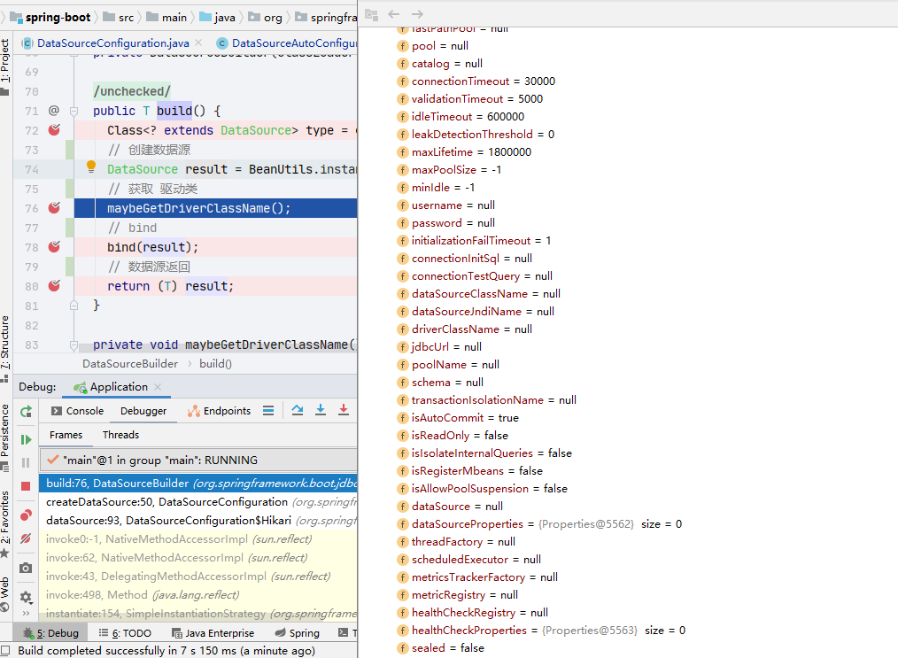
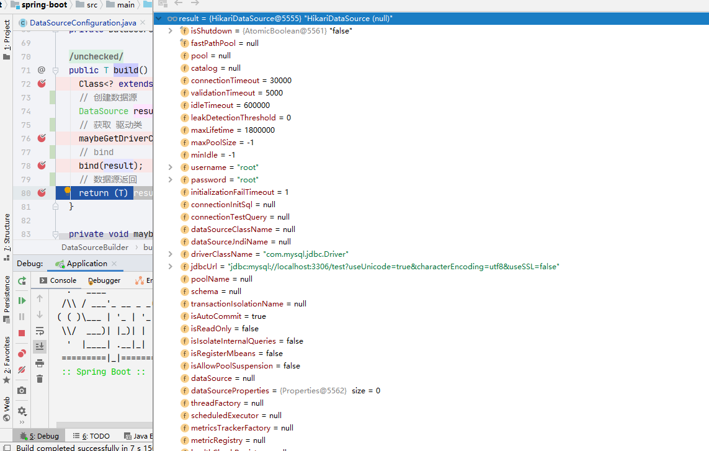

# SpringBoot JDBC
- Author: [HuiFer](https://github.com/huifer)
- 源码阅读仓库: [SourceHot-spring-boot](https://github.com/SourceHot/spring-boot-read)


## 相关类

- **`DataSourceProperties`** 数据源配置信息	

- 自动配置:**`org.springframework.boot.autoconfigure.jdbc` **
  - **`DataSourceAutoConfiguration`** 数据源自动配置
  - **`JdbcTemplateAutoConfiguration` **jdbc template 自动配置
  - **`DataSourceTransactionManagerAutoConfiguration`** 事物相关自动配置


- 根据我们使用jdbc的流程先进行配置，在获取链接对象，进行操作。根据上述流程我们的分析流程
  1. DataSourceAutoConfiguration
  2. DataSourceProperties
  3. JdbcTemplateAutoConfiguration
  4. DataSourceTransactionManagerAutoConfiguration


## DataSourceAutoConfiguration

- 数据源自动配置

- 路径: `org.springframework.boot.autoconfigure.jdbc.DataSourceAutoConfiguration`

- 自动注入了很多和数据库相关的配置信息

```java
@Configuration(proxyBeanMethods = false)
@ConditionalOnClass({ DataSource.class, EmbeddedDatabaseType.class })
@EnableConfigurationProperties(DataSourceProperties.class)
@Import({ DataSourcePoolMetadataProvidersConfiguration.class, DataSourceInitializationConfiguration.class })
public class DataSourceAutoConfiguration {}
```


- 连接池配置

  ```JAVA
  
  	@Configuration(proxyBeanMethods = false)
  	@Conditional(PooledDataSourceCondition.class)
  	@ConditionalOnMissingBean({ DataSource.class, XADataSource.class })
  	@Import({ DataSourceConfiguration.Hikari.class, DataSourceConfiguration.Tomcat.class,
  			DataSourceConfiguration.Dbcp2.class, DataSourceConfiguration.Generic.class,
  			DataSourceJmxConfiguration.class })
  	protected static class PooledDataSourceConfiguration {
  
  	}
  ```

  


## DataSourceProperties

- 数据源配置信息

- 路径: `org.springframework.boot.autoconfigure.jdbc.DataSourceProperties`

- 下面代码为摘取部分,这个类会将**`application.yml`** 文件中的配置信息读取并且保存到这个对象中

```java
@ConfigurationProperties(prefix = "spring.datasource")
public class DataSourceProperties implements BeanClassLoaderAware, InitializingBean {
    
    private String driverClassName;
	private String url;
	private String username;
	private String password;

    
}
```





- 完整的调用链路不展开讲解

- 一些接口的实现方法`afterPropertiesSet` 

- 这部分内容的debug 方式在`setXXX`上着手

  

- 这里的代码笔者在分析`ConfigurationProperties` 已经分析过一次了本文只作为一个截图和debug的流程方式描述

## DataSourceConfiguration

- 数据源配置，这个类会

````java
    /**
     * 创建 datasource
     * @param properties dataSource 配置信息
     * @param type 数据源类型
     * @param <T>
     * @return
     */
	@SuppressWarnings("unchecked")
	protected static <T> T createDataSource(DataSourceProperties properties, Class<? extends DataSource> type) {
		return (T) properties.initializeDataSourceBuilder().type(type).build();
	}

````





```JAVA
		@Bean
		@ConfigurationProperties(prefix = "spring.datasource.hikari")
		HikariDataSource dataSource(DataSourceProperties properties) {
			HikariDataSource dataSource = createDataSource(properties, HikariDataSource.class);
			if (StringUtils.hasText(properties.getName())) {
				dataSource.setPoolName(properties.getName());
			}
			return dataSource;
		}

```


- `org.springframework.boot.autoconfigure.jdbc.DataSourceConfiguration#createDataSource`
  - `.type(type)` 属性设置

```JAVA
	@SuppressWarnings("unchecked")
	protected static <T> T createDataSource(DataSourceProperties properties, Class<? extends DataSource> type) {
		return (T) properties.initializeDataSourceBuilder().type(type).build();
	}

```

​	

- `org.springframework.boot.autoconfigure.jdbc.DataSourceProperties#initializeDataSourceBuilder`

```JAVA
	public DataSourceBuilder<?> initializeDataSourceBuilder() {
	    // 链式设置属性
		return DataSourceBuilder.create(getClassLoader()).type(getType()).driverClassName(determineDriverClassName())
				.url(determineUrl()).username(determineUsername()).password(determinePassword());
	}

```


- `org.springframework.boot.jdbc.DataSourceBuilder#build`

  ```java
  	@SuppressWarnings("unchecked")
  	public T build() {
  		Class<? extends DataSource> type = getType();
  		// 创建数据源
  		DataSource result = BeanUtils.instantiateClass(type);
  		// 获取 驱动类
  		maybeGetDriverClassName();
  		// bind
  		bind(result);
  		// 数据源返回
  		return (T) result;
  	}
  
  ```


- 绑定前

  


- 绑定后

  

## JdbcTemplateAutoConfiguration

- jdbc template 自动配置

- 路径: `org.springframework.boot.autoconfigure.jdbc.JdbcTemplateAutoConfiguration`

```JAVA
@Configuration(proxyBeanMethods = false)
@ConditionalOnClass({ DataSource.class, JdbcTemplate.class })
@ConditionalOnSingleCandidate(DataSource.class)
@AutoConfigureAfter(DataSourceAutoConfiguration.class)
@EnableConfigurationProperties(JdbcProperties.class)
@Import({ JdbcTemplateConfiguration.class, NamedParameterJdbcTemplateConfiguration.class })
public class JdbcTemplateAutoConfiguration {

}

```

- 两个import类作为重点

### JdbcTemplateConfiguration

- `org.springframework.boot.autoconfigure.jdbc.JdbcTemplateConfiguration`

```java
@Configuration(proxyBeanMethods = false)
@ConditionalOnMissingBean(JdbcOperations.class)
class JdbcTemplateConfiguration {

    /**
     * 创建 jdbc template
     * @param dataSource
     * @param properties
     * @return
     */
	@Bean
	@Primary
	JdbcTemplate jdbcTemplate(DataSource dataSource, JdbcProperties properties) {
		JdbcTemplate jdbcTemplate = new JdbcTemplate(dataSource);
		JdbcProperties.Template template = properties.getTemplate();
		jdbcTemplate.setFetchSize(template.getFetchSize());
		jdbcTemplate.setMaxRows(template.getMaxRows());
		if (template.getQueryTimeout() != null) {
			jdbcTemplate.setQueryTimeout((int) template.getQueryTimeout().getSeconds());
		}
		return jdbcTemplate;
	}

}	
```


### NamedParameterJdbcTemplateConfiguration

```JAVA
@Configuration(proxyBeanMethods = false)
@ConditionalOnSingleCandidate(JdbcTemplate.class)
@ConditionalOnMissingBean(NamedParameterJdbcOperations.class)
class NamedParameterJdbcTemplateConfiguration {

	@Bean
	@Primary
	NamedParameterJdbcTemplate namedParameterJdbcTemplate(JdbcTemplate jdbcTemplate) {
		return new NamedParameterJdbcTemplate(jdbcTemplate);
	}

}
```


- 这两个类操作很简单，就是创建bean对象 注入到spring 中


## DataSourceTransactionManagerAutoConfiguration

- 数据源事物自动配置