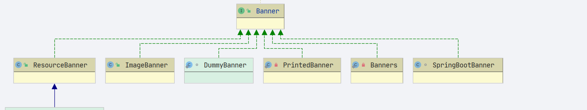

# SpringBoot Banner


## 输出方式
- `org.springframework.boot.Banner.Mode`

```java
	/**
	 * An enumeration of possible values for configuring the Banner.
	 *
	 * 输出类型
	 */
	enum Mode {

		/**
		 * Disable printing of the banner.
		 * 禁止banner的输出
		 */
		OFF,

		/**
		 * Print the banner to System.out.
		 * banner 输出到控制台
		 */
		CONSOLE,

		/**
		 * Print the banner to the log file.
		 * banner 输出到日志文件
		 */
		LOG

	}

```


## banner 输出方法
- `org.springframework.boot.Banner.printBanner`




- `org.springframework.boot.ImageBanner`: 图片banner输出
- `org.springframework.boot.SpringBootBanner` : 默认的 spring boot banner 输出
- `org.springframework.boot.ResourceBanner` : 资源 banner 输出 , 文件形式


- 入口函数: `org.springframework.boot.SpringApplication.printBanner`
```java
	private Banner printBanner(ConfigurableEnvironment environment) {
		if (this.bannerMode == Banner.Mode.OFF) {
			return null;
		}
		ResourceLoader resourceLoader = (this.resourceLoader != null) ? this.resourceLoader
				: new DefaultResourceLoader(getClassLoader());
		// 创建打印器
		SpringApplicationBannerPrinter bannerPrinter = new SpringApplicationBannerPrinter(resourceLoader, this.banner);
		if (this.bannerMode == Mode.LOG) {
			// 输出
			return bannerPrinter.print(environment, this.mainApplicationClass, logger);
		}
		// 输出
		return bannerPrinter.print(environment, this.mainApplicationClass, System.out);
	}

```

- 关注 SpringApplicationBannerPrinter 的 print 方法

```java
	Banner print(Environment environment, Class<?> sourceClass, Log logger) {
		// 获取 banner 
		Banner banner = getBanner(environment);
		try {
			logger.info(createStringFromBanner(banner, environment, sourceClass));
		}
		catch (UnsupportedEncodingException ex) {
			logger.warn("Failed to create String for banner", ex);
		}
		return new PrintedBanner(banner, sourceClass);
	}

```

- `PrintedBanner`
    
```java
	private static class PrintedBanner implements Banner {

		private final Banner banner;
		private final Class<?> sourceClass;

		PrintedBanner(Banner banner, Class<?> sourceClass) {
			this.banner = banner;
			this.sourceClass = sourceClass;
		}

		@Override
		public void printBanner(Environment environment, Class<?> sourceClass, PrintStream out) {
			sourceClass = (sourceClass != null) ? sourceClass : this.sourceClass;
			this.banner.printBanner(environment, sourceClass, out);
		}

	}

```
- 核心方法 printBanner , 这里的 banner 会具体成为以下几个的其中一个
    1. ImageBanner
    1. SpringBootBanner
    1. ResourceBanner
    
    
默认的 SpringBootBanner

```java
class SpringBootBanner implements Banner {

	private static final String[] BANNER = { "", "  .   ____          _            __ _ _",
			" /\\\\ / ___'_ __ _ _(_)_ __  __ _ \\ \\ \\ \\", "( ( )\\___ | '_ | '_| | '_ \\/ _` | \\ \\ \\ \\",
			" \\\\/  ___)| |_)| | | | | || (_| |  ) ) ) )", "  '  |____| .__|_| |_|_| |_\\__, | / / / /",
			" =========|_|==============|___/=/_/_/_/" };

	private static final String SPRING_BOOT = " :: Spring Boot :: ";

	private static final int STRAP_LINE_SIZE = 42;

	@Override
	public void printBanner(Environment environment, Class<?> sourceClass, PrintStream printStream) {
		for (String line : BANNER) {
			printStream.println(line);
		}
		String version = SpringBootVersion.getVersion();
		version = (version != null) ? " (v" + version + ")" : "";
		StringBuilder padding = new StringBuilder();
		while (padding.length() < STRAP_LINE_SIZE - (version.length() + SPRING_BOOT.length())) {
			padding.append(" ");
		}

		printStream.println(AnsiOutput.toString(AnsiColor.GREEN, SPRING_BOOT, AnsiColor.DEFAULT, padding.toString(),
				AnsiStyle.FAINT, version));
		printStream.println();
	}

}
```
- 上面这段代码就是将字符串往 PrintStream 写入,最后统一输出