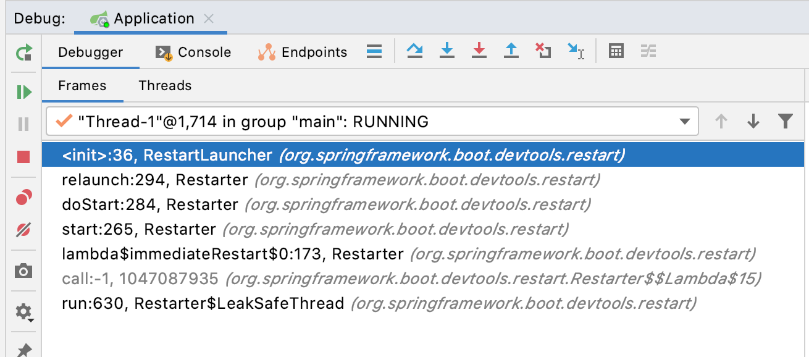
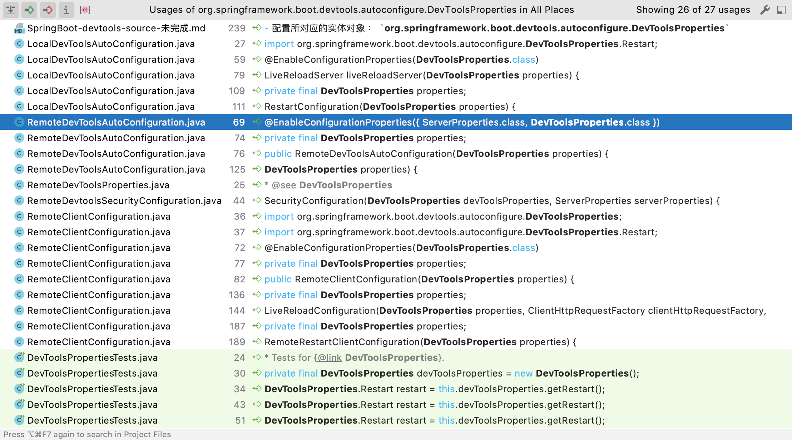
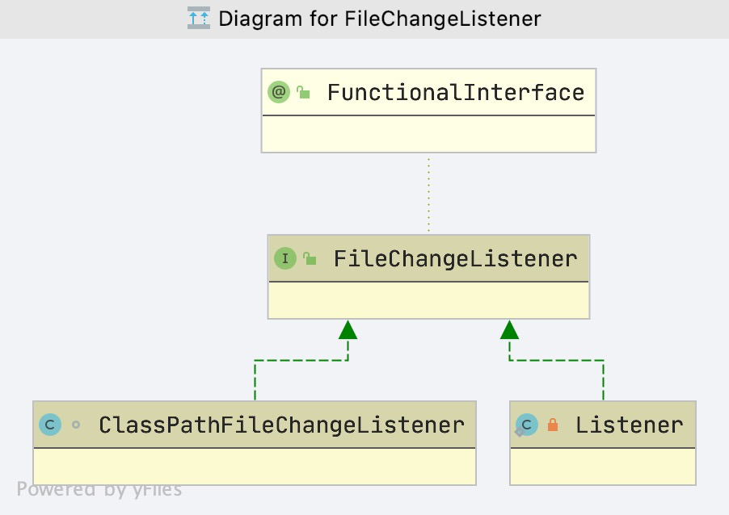

# SpringBoot devtools 源码分析
## 依赖引入
```xml
<dependency>
    <groupId>org.springframework.boot</groupId>
    <artifactId>spring-boot-devtools</artifactId>
    <version>${revision}</version>
    <scope>runtime</scope>
</dependency>
```

## 源码分析

- 启动观察启动日志
```text
Connected to the target VM, address: '127.0.0.1:53900', transport: 'socket'

  .   ____          _            __ _ _
 /\\ / ___'_ __ _ _(_)_ __  __ _ \ \ \ \
( ( )\___ | '_ | '_| | '_ \/ _` | \ \ \ \
 \\/  ___)| |_)| | | | | || (_| |  ) ) ) )
  '  |____| .__|_| |_|_| |_\__, | / / / /
 =========|_|==============|___/=/_/_/_/
 :: Spring Boot ::                        

2020-05-15 14:56:46.522  INFO 5989 --- [  restartedMain] org.sourcehot.Application                : Starting Application on huiferdeMacBook-Pro.local with PID 5989 (/Users/huifer/IdeaProjects/spring-sx/spring-boot-read/source-hot-spring-boot/target/classes started by huifer in /Users/huifer/IdeaProjects/spring-sx)
2020-05-15 14:56:46.525  INFO 5989 --- [  restartedMain] org.sourcehot.Application                : No active profile set, falling back to default profiles: default
2020-05-15 14:56:46.573  INFO 5989 --- [  restartedMain] .e.DevToolsPropertyDefaultsPostProcessor : Devtools property defaults active! Set 'spring.devtools.add-properties' to 'false' to disable
2020-05-15 14:56:46.573  INFO 5989 --- [  restartedMain] .e.DevToolsPropertyDefaultsPostProcessor : For additional web related logging consider setting the 'logging.level.web' property to 'DEBUG'
2020-05-15 14:56:47.530  INFO 5989 --- [  restartedMain] o.s.b.w.embedded.tomcat.TomcatWebServer  : Tomcat initialized with port(s): 9999 (http)
2020-05-15 14:56:47.538  INFO 5989 --- [  restartedMain] o.apache.catalina.core.StandardService   : Starting service [Tomcat]
2020-05-15 14:56:47.539  INFO 5989 --- [  restartedMain] org.apache.catalina.core.StandardEngine  : Starting Servlet engine: [Apache Tomcat/9.0.30]
2020-05-15 14:56:47.598  INFO 5989 --- [  restartedMain] o.a.c.c.C.[Tomcat].[localhost].[/]       : Initializing Spring embedded WebApplicationContext
2020-05-15 14:56:47.598  INFO 5989 --- [  restartedMain] o.s.web.context.ContextLoader            : Root WebApplicationContext: initialization completed in 1024 ms
2020-05-15 14:56:47.753  INFO 5989 --- [  restartedMain] o.s.s.concurrent.ThreadPoolTaskExecutor  : Initializing ExecutorService 'applicationTaskExecutor'
2020-05-15 14:56:47.910  INFO 5989 --- [  restartedMain] o.s.b.d.a.OptionalLiveReloadServer       : LiveReload server is running on port 35729
2020-05-15 14:56:47.976  INFO 5989 --- [  restartedMain] o.s.b.w.embedded.tomcat.TomcatWebServer  : Tomcat started on port(s): 9999 (http) with context path ''
2020-05-15 14:56:47.981  INFO 5989 --- [  restartedMain] org.sourcehot.Application                : Started Application in 1.926 seconds (JVM running for 4.789)
```

- 从启动日志上我们可以看到 **restartedMain** 关键字, 搜索后可以在`org.springframework.boot.devtools.restart.RestartLauncher`找到, `RestartLauncher`用于启动重新启动的应用程序的线程。


### RestartLaucher

#### mainClassName

- 跟踪 `RestartLauncher`

  

首先关注这个类的初始化


- 构造方法参数如下

```java
/**
	 * 初始化方法
	 *
	 * @param classLoader      类加载器
	 * @param mainClassName    启动类
	 * @param args             参数
	 * @param exceptionHandler 异常处理对象
	 */
	RestartLauncher(ClassLoader classLoader, String mainClassName, String[] args,
					UncaughtExceptionHandler exceptionHandler) {
		this.mainClassName = mainClassName;
		this.args = args;
		setName("restartedMain");
		setUncaughtExceptionHandler(exceptionHandler);
		setDaemon(false);
		setContextClassLoader(classLoader);
	}
```


- 什么时候放入的这些参数?
  - `org.springframework.boot.devtools.restart.RestartApplicationListener#onApplicationStartingEvent` 
  - `org.springframework.boot.devtools.restart.Restarter#initialize(java.lang.String[], boolean, org.springframework.boot.devtools.restart.RestartInitializer, boolean)`


```java
	public static void initialize(String[] args, boolean forceReferenceCleanup, RestartInitializer initializer,
			boolean restartOnInitialize) {
		Restarter localInstance = null;
		synchronized (INSTANCE_MONITOR) {
			if (instance == null) {
				localInstance = new Restarter(Thread.currentThread(), args, forceReferenceCleanup, initializer);
				instance = localInstance;
			}
		}
		if (localInstance != null) {
			localInstance.initialize(restartOnInitialize);
		}
	}

```

构造方法中暗藏玄机

```java
	protected Restarter(Thread thread, String[] args, boolean forceReferenceCleanup, RestartInitializer initializer) {
		Assert.notNull(thread, "Thread must not be null");
		Assert.notNull(args, "Args must not be null");
		Assert.notNull(initializer, "Initializer must not be null");
		if (this.logger.isDebugEnabled()) {
			this.logger.debug("Creating new Restarter for thread " + thread);
		}
		SilentExitExceptionHandler.setup(thread);
		this.forceReferenceCleanup = forceReferenceCleanup;
		this.initialUrls = initializer.getInitialUrls(thread);
		this.mainClassName = getMainClassName(thread);
		this.applicationClassLoader = thread.getContextClassLoader();
		this.args = args;
		this.exceptionHandler = thread.getUncaughtExceptionHandler();
		this.leakSafeThreads.add(new LeakSafeThread());
	}

```

- 通过构造方法我们可以看到    `getMainClassName` 这个方法的作用就是获取 mainClassName

```java
	/**
	 * 获取 mainClassName
	 * @param thread
	 * @return
	 */
	private String getMainClassName(Thread thread) {
		try {
			// 创建对象获取类名
			return new MainMethod(thread).getDeclaringClassName();
		}
		catch (Exception ex) {
			return null;
		}
	}

```


- MainMethod 内部代码

```java
	/**
	 * 构造
	 * @param thread
	 */
	MainMethod(Thread thread) {
		Assert.notNull(thread, "Thread must not be null");
		// 获取 main method
		this.method = getMainMethod(thread);
	}


	/**
	 * 循环线程堆栈找到 main method
	 *
	 * @param thread
	 *
	 * @return
	 */
	private Method getMainMethod(Thread thread) {
		for (StackTraceElement element : thread.getStackTrace()) {
			if ("main".equals(element.getMethodName())) {
				Method method = getMainMethod(element);
				if (method != null) {
					return method;
				}
			}
		}
		throw new IllegalStateException("Unable to find main method");
	}


	/**
	 * Return the name of the declaring class.
	 * <p>
	 * 将 method 所在的类名找出来
	 *
	 * @return the declaring class name
	 */
	String getDeclaringClassName() {
		return this.method.getDeclaringClass().getName();
	}

```


- 这样我们就找到了 mainClassName 的获取过程


#### run 方法

- 这段代码就是很简单的啦, 将 mainClassname 加载出来 并且调用 main 方法

```java
	@Override
	public void run() {
		try {
			// 加载 main 方法所在的类 并且启动
			Class<?> mainClass = getContextClassLoader().loadClass(this.mainClassName);
			Method mainMethod = mainClass.getDeclaredMethod("main", String[].class);
			mainMethod.invoke(null, new Object[]{this.args});
		}
		catch (Throwable ex) {
			this.error = ex;
			getUncaughtExceptionHandler().uncaughtException(this, ex);
		}
	}

```


### DevToolsProperties 

- 配置信息说明 : [官方文档](https://docs.spring.io/spring-boot/docs/2.2.7.RELEASE/reference/html/appendix-application-properties.html#devtools-properties)

- 配置所对应的实体对象 ： `org.springframework.boot.devtools.autoconfigure.DevToolsProperties`



使用到的类 , 找到`LocalDevToolsAutoConfiguration`对象进行分析


- 思考一个问题什么时候需要热部署，或者说重启项目。一般对代码有所改动的时候我们回去重启项目。文件改动应该需要一个监听

  我们可以看到代码

  ```java
  		@Bean
  		@ConditionalOnMissingBean
  		ClassPathFileSystemWatcher classPathFileSystemWatcher(FileSystemWatcherFactory fileSystemWatcherFactory,
  				ClassPathRestartStrategy classPathRestartStrategy) {
  			// urls = 编译后的文件存放地址
  			URL[] urls = Restarter.getInstance().getInitialUrls();
  			ClassPathFileSystemWatcher watcher = new ClassPathFileSystemWatcher(fileSystemWatcherFactory,
  					classPathRestartStrategy, urls);
  			watcher.setStopWatcherOnRestart(true);
  			// 实例化后调用 org.springframework.boot.devtools.classpath.ClassPathFileSystemWatcher.afterPropertiesSet
  			return watcher;
  		}
  
  ```

  

- 进入`ClassPathFileSystemWatcher`内部查看方法`org.springframework.boot.devtools.classpath.ClassPathFileSystemWatcher#afterPropertiesSet`

  这个方法大家都很熟悉，触发时间在设置完成属性后

  ```java
  @Override
  public void afterPropertiesSet() throws Exception {
     if (this.restartStrategy != null) {
        FileSystemWatcher watcherToStop = null;
        if (this.stopWatcherOnRestart) {
           watcherToStop = this.fileSystemWatcher;
        }
        this.fileSystemWatcher.addListener(
              new ClassPathFileChangeListener(this.applicationContext, this.restartStrategy, watcherToStop));
     }
     this.fileSystemWatcher.start();
  }
  ```

  - 主要行为
    1. 添加监听器
    2. 启动

  - 由此可见`FileSystemWatcher` 是重头戏呀


### FileSystemWatcher


- `org.springframework.boot.devtools.filewatch.FileSystemWatcher#start`

```java
	public void start() {
		synchronized (this.monitor) {
			saveInitialSnapshots();
			if (this.watchThread == null) {
				Map<File, FolderSnapshot> localFolders = new HashMap<>(this.folders);
				this.watchThread = new Thread(new Watcher(this.remainingScans, new ArrayList<>(this.listeners),
						this.triggerFilter, this.pollInterval, this.quietPeriod, localFolders));
				this.watchThread.setName("File Watcher");
				this.watchThread.setDaemon(this.daemon);
				this.watchThread.start();
			}
		}
	}

```

- `org.springframework.boot.devtools.filewatch.FileSystemWatcher.Watcher#run`

```java
		@Override
		public void run() {
			int remainingScans = this.remainingScans.get();
			while (remainingScans > 0 || remainingScans == -1) {
				try {
					if (remainingScans > 0) {
						this.remainingScans.decrementAndGet();
					}
					// 对比
					scan();
				}
				catch (InterruptedException ex) {
					Thread.currentThread().interrupt();
				}
				remainingScans = this.remainingScans.get();
			}
		}

```

- `org.springframework.boot.devtools.filewatch.FileSystemWatcher.Watcher#scan`

```java
private void scan() throws InterruptedException {
			Thread.sleep(this.pollInterval - this.quietPeriod);
			Map<File, FolderSnapshot> previous;
			Map<File, FolderSnapshot> current = this.folders;
			do {
				previous = current;
				current = getCurrentSnapshots();
				Thread.sleep(this.quietPeriod);
			}
			// 差异对比
			while (isDifferent(previous, current));
			if (isDifferent(this.folders, current)) {
				updateSnapshots(current.values());
			}
		}
```


- `org.springframework.boot.devtools.filewatch.FileSystemWatcher.Watcher#updateSnapshots`

```java
private void updateSnapshots(Collection<FolderSnapshot> snapshots) {
   Map<File, FolderSnapshot> updated = new LinkedHashMap<>();
   Set<ChangedFiles> changeSet = new LinkedHashSet<>();
   for (FolderSnapshot snapshot : snapshots) {
      FolderSnapshot previous = this.folders.get(snapshot.getFolder());
      updated.put(snapshot.getFolder(), snapshot);
      ChangedFiles changedFiles = previous.getChangedFiles(snapshot, this.triggerFilter);
      if (!changedFiles.getFiles().isEmpty()) {
         changeSet.add(changedFiles);
      }
   }
   if (!changeSet.isEmpty()) {
      // 发送事件
      fireListeners(Collections.unmodifiableSet(changeSet));
   }
   this.folders = updated;
}
```


- `org.springframework.boot.devtools.filewatch.FileChangeListener`

```java
@FunctionalInterface
public interface FileChangeListener {

   /**
    * Called when files have been changed.
    *
    * 在文件变动的时候执行该函数
    * @param changeSet a set of the {@link ChangedFiles}
    */
   void onChange(Set<ChangedFiles> changeSet);

}
```





#### ClassPathFileChangeListener

```java
	@Override
	public void onChange(Set<ChangedFiles> changeSet) {
		// 是否需要重启
		boolean restart = isRestartRequired(changeSet);
		// 发布事件
		publishEvent(new ClassPathChangedEvent(this, changeSet, restart));
	}

```

#### ClassPathChangedEvent
- 类变动事件
```java
	/**
	 * 变动的文件
	 */
	private final Set<ChangedFiles> changeSet;
```

- 处理事件的方法`org.springframework.boot.devtools.autoconfigure.LocalDevToolsAutoConfiguration.LiveReloadServerEventListener.onApplicationEvent`

```java
@Override
		public void onApplicationEvent(ApplicationEvent event) {
			if (event instanceof ContextRefreshedEvent || (event instanceof ClassPathChangedEvent
					&& !((ClassPathChangedEvent) event).isRestartRequired())) {
				this.liveReloadServer.triggerReload();
			}
		}
```
- 最后的处理
- `org.springframework.boot.devtools.autoconfigure.OptionalLiveReloadServer.triggerReload`
    - `org.springframework.boot.devtools.livereload.LiveReloadServer.triggerReload`
- 具体的包:`org.springframework.boot.devtools.livereload`
    - 主要采用 socket 技术进行重启