# SpringBoot 嵌入式容器
- Author: [HuiFer](https://github.com/huifer)
- 源码阅读仓库: [SourceHot-spring-boot](https://github.com/SourceHot/spring-boot-read)


## 依赖

- 一个web项目我们最基础的依赖就是**`spring-boot-starter-web`**

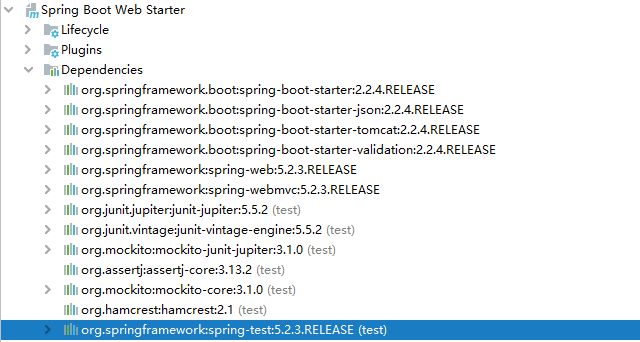


## 配置

- 最直观的一个配置`server.port=8080` tomcat 中我们也可以配置服务端口，对此我怀疑保存`server.port`属性的对象中应该有何tomcat相关的东西

  - `org.springframework.boot.autoconfigure.web.ServerProperties`

  - 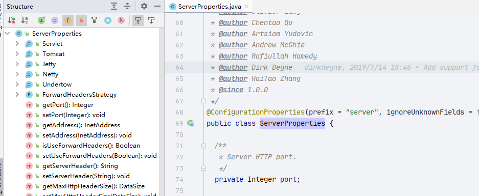

    果不其然李曼存放了 `tomcat`,`servlet`,`jetty` ,`netty `这些容器的对象

- 补充： 替换tomcat

```XML

<dependency>
    <groupId>org.springframework.boot</groupId>
    <artifactId>spring-boot-starter-web</artifactId>
    <exclusions>
        <exclusion>
            <groupId>org.springframework.boot</groupId>
            <artifactId>spring-boot-starter-tomcat</artifactId>
        </exclusion>
    </exclusions>
</dependency>
 
<dependency>
    <groupId>org.springframework.boot</groupId>
    <artifactId>spring-boot-starter-jetty</artifactId>
</dependency>
```


- 已经找到关键类了，剩下的就去看那些地方用了这个类，开始源码分析。


- 使用的类，我们这里关注的是`TomcatWebServerFactoryCustomizer` , 这个类名和服务相关因此我已这个作为主要的观察

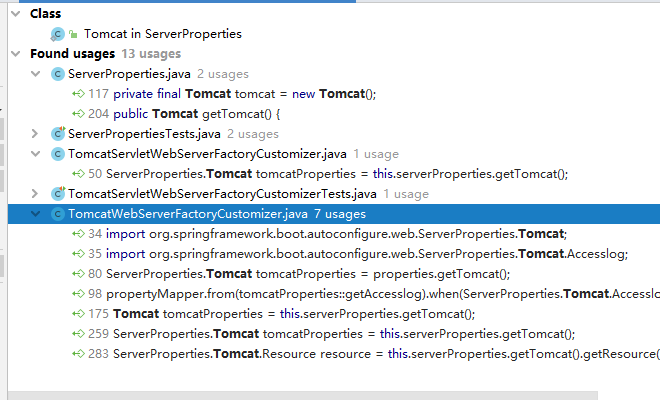


- 看`TomcatWebServerFactoryCustomizer`类 找一找调用的地方

  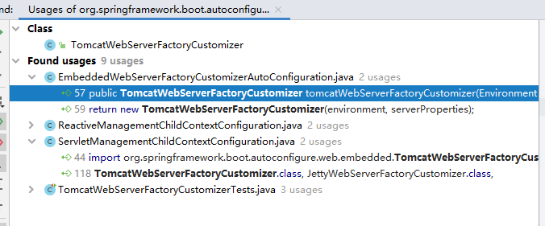

  - 重大发现 `EmbeddedWebServerFactoryCustomizerAutoConfiguration` 

    - 第一个单词`Embedded`嵌入式

    - 整个类的意思：嵌入式Web服务器出厂自定义程序自动配置

    - 重点不是说翻译这个单词，这只是作为我阅读的一个依据以及寻找的一个方式。

    - 这个类有

      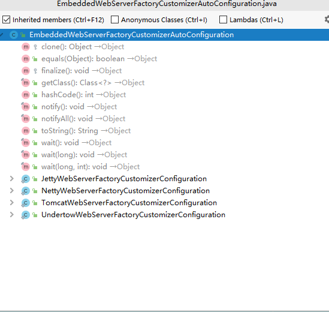

      - 几个web服务容器都在了可以正式开始了，这个就是**入口**


## 源码

- 断点打上开始了

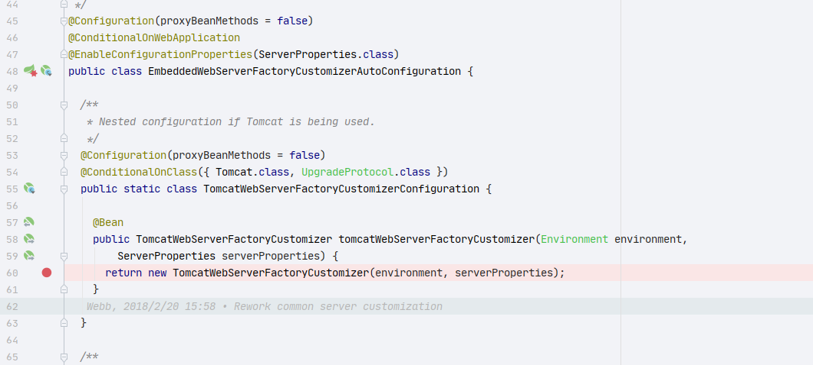


配置信息：

```YAML
server:
  port: 9999
  tomcat:
    # 最大线程数
    max-threads: 6
    # 最小线程数
    min-spare-threads: 3
    # 队列长度
    accept-count: 10
    # 最大链接数
    max-connections: 1000
```


调用链路

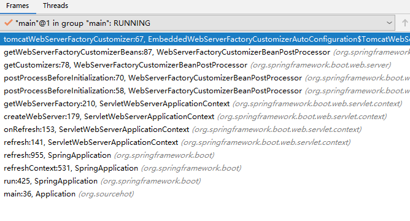


- 关注**`serverProperties`**属性

  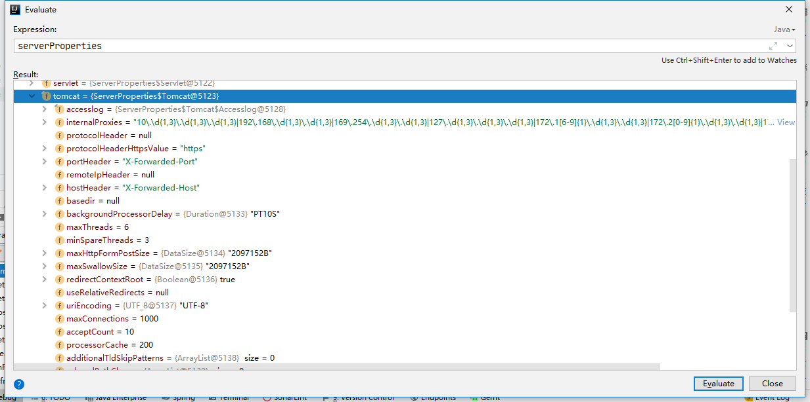


```JAVA
		@Bean
		public TomcatWebServerFactoryCustomizer tomcatWebServerFactoryCustomizer(Environment environment,
				ServerProperties serverProperties) {
			return new TomcatWebServerFactoryCustomizer(environment, serverProperties);
		}
```


- 创建bean 默认单例

  后续流程中在spring体系中执行bean的生命周期相关的操作

  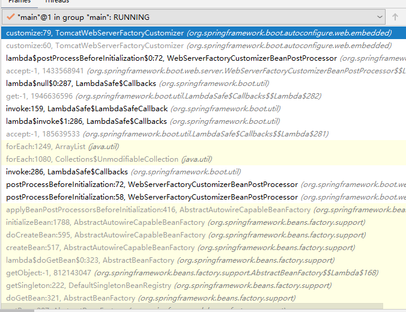


一些流程的查看


### WebServerFactoryCustomizerBeanPostProcessor

- web服务定制工厂的生命周期相关操作

- `org.springframework.boot.web.server.WebServerFactoryCustomizerBeanPostProcessor#postProcessBeforeInitialization(java.lang.Object, java.lang.String)`


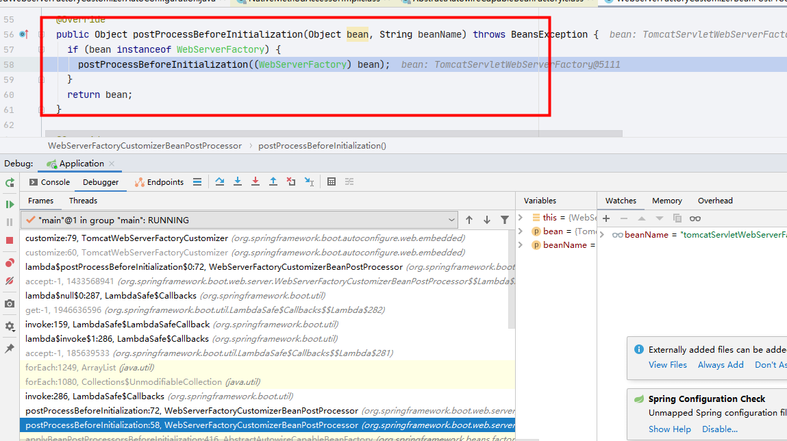


```JAVA
	@Override
	public Object postProcessBeforeInitialization(Object bean, String beanName) throws BeansException {
		if (bean instanceof WebServerFactory) {
			postProcessBeforeInitialization((WebServerFactory) bean);
		}
		return bean;
	}

```


```JAVA
	@SuppressWarnings("unchecked")
	private void postProcessBeforeInitialization(WebServerFactory webServerFactory) {
		LambdaSafe.callbacks(WebServerFactoryCustomizer.class, getCustomizers(), webServerFactory)
				.withLogger(WebServerFactoryCustomizerBeanPostProcessor.class)
				.invoke((customizer) -> customizer.customize(webServerFactory));
	}

```


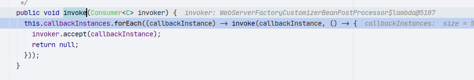


- 最终到了：`org.springframework.boot.autoconfigure.web.embedded.TomcatWebServerFactoryCustomizer#customize`


```java
	@Override
	public void customize(ConfigurableTomcatWebServerFactory factory) {
		ServerProperties properties = this.serverProperties;
		ServerProperties.Tomcat tomcatProperties = properties.getTomcat();
		PropertyMapper propertyMapper = PropertyMapper.get();
		propertyMapper.from(tomcatProperties::getBasedir).whenNonNull().to(factory::setBaseDirectory);
		propertyMapper.from(tomcatProperties::getBackgroundProcessorDelay).whenNonNull().as(Duration::getSeconds)
				.as(Long::intValue).to(factory::setBackgroundProcessorDelay);
		customizeRemoteIpValve(factory);
		propertyMapper.from(tomcatProperties::getMaxThreads).when(this::isPositive)
				.to((maxThreads) -> customizeMaxThreads(factory, tomcatProperties.getMaxThreads()));
		propertyMapper.from(tomcatProperties::getMinSpareThreads).when(this::isPositive)
				.to((minSpareThreads) -> customizeMinThreads(factory, minSpareThreads));
		propertyMapper.from(this.serverProperties.getMaxHttpHeaderSize()).whenNonNull().asInt(DataSize::toBytes)
				.when(this::isPositive)
				.to((maxHttpHeaderSize) -> customizeMaxHttpHeaderSize(factory, maxHttpHeaderSize));
		propertyMapper.from(tomcatProperties::getMaxSwallowSize).whenNonNull().asInt(DataSize::toBytes)
				.to((maxSwallowSize) -> customizeMaxSwallowSize(factory, maxSwallowSize));
		propertyMapper.from(tomcatProperties::getMaxHttpFormPostSize).asInt(DataSize::toBytes)
				.when((maxHttpFormPostSize) -> maxHttpFormPostSize != 0)
				.to((maxHttpFormPostSize) -> customizeMaxHttpFormPostSize(factory, maxHttpFormPostSize));
		propertyMapper.from(tomcatProperties::getAccesslog).when(ServerProperties.Tomcat.Accesslog::isEnabled)
				.to((enabled) -> customizeAccessLog(factory));
		propertyMapper.from(tomcatProperties::getUriEncoding).whenNonNull().to(factory::setUriEncoding);
		propertyMapper.from(properties::getConnectionTimeout).whenNonNull()
				.to((connectionTimeout) -> customizeConnectionTimeout(factory, connectionTimeout));
		propertyMapper.from(tomcatProperties::getConnectionTimeout).whenNonNull()
				.to((connectionTimeout) -> customizeConnectionTimeout(factory, connectionTimeout));
		propertyMapper.from(tomcatProperties::getMaxConnections).when(this::isPositive)
				.to((maxConnections) -> customizeMaxConnections(factory, maxConnections));
		propertyMapper.from(tomcatProperties::getAcceptCount).when(this::isPositive)
				.to((acceptCount) -> customizeAcceptCount(factory, acceptCount));
		propertyMapper.from(tomcatProperties::getProcessorCache)
				.to((processorCache) -> customizeProcessorCache(factory, processorCache));
		propertyMapper.from(tomcatProperties::getRelaxedPathChars).as(this::joinCharacters).whenHasText()
				.to((relaxedChars) -> customizeRelaxedPathChars(factory, relaxedChars));
		propertyMapper.from(tomcatProperties::getRelaxedQueryChars).as(this::joinCharacters).whenHasText()
				.to((relaxedChars) -> customizeRelaxedQueryChars(factory, relaxedChars));
		customizeStaticResources(factory);
		customizeErrorReportValve(properties.getError(), factory);
	}

```


- 该方法就是赋值 `factory`

- 设置具体的值

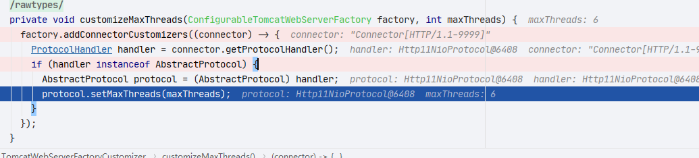


### ServletWebServerApplicationContext	


#### createWebServer

```JAVA
	private void createWebServer() {
		WebServer webServer = this.webServer;
		ServletContext servletContext = getServletContext();
		if (webServer == null && servletContext == null) {
		    // 创建 工厂
			ServletWebServerFactory factory = getWebServerFactory();
			// 初始化webServer
			this.webServer = factory.getWebServer(getSelfInitializer());
		}
		else if (servletContext != null) {
			try {
			    // 启动服务
				getSelfInitializer().onStartup(servletContext);
			}
			catch (ServletException ex) {
				throw new ApplicationContextException("Cannot initialize servlet context", ex);
			}
		}
		initPropertySources();
	}

```


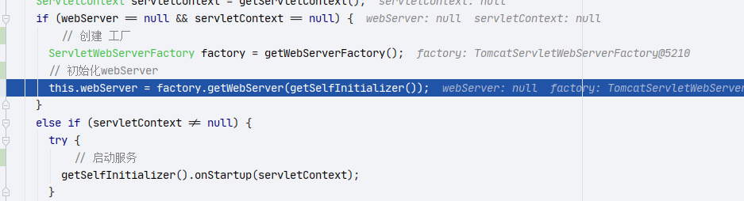


- 剩下的代码在spring中执行不再继续追踪