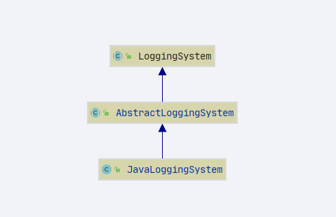

# SpringBoot 日志系统
- Author: [HuiFer](https://github.com/huifer)
- 源码阅读仓库: [SourceHot-spring-boot](https://github.com/SourceHot/spring-boot-read)

- 包路径: `org.springframework.boot.logging`

## 日志级别
- 日志级别: `org.springframework.boot.logging.LogLevel`
```java
public enum LogLevel {
	TRACE, DEBUG, INFO, WARN, ERROR, FATAL, OFF
}
```


## java 日志实现

- `org.springframework.boot.logging.java.JavaLoggingSystem`



```JAVA
	static {
	    // KEY :  springBoot 定义的日志级别, value: jdk 定义的日志级别
		LEVELS.map(LogLevel.TRACE, Level.FINEST);
		LEVELS.map(LogLevel.DEBUG, Level.FINE);
		LEVELS.map(LogLevel.INFO, Level.INFO);
		LEVELS.map(LogLevel.WARN, Level.WARNING);
		LEVELS.map(LogLevel.ERROR, Level.SEVERE);
		LEVELS.map(LogLevel.FATAL, Level.SEVERE);
		LEVELS.map(LogLevel.OFF, Level.OFF);
	}
```

- LEVELS 对象

  ```java
  	protected static class LogLevels<T> {
  
        /**
         * key ： SpringBoot 中定义的日志级别, value: 其他日志框架的日志级别
         */
  		private final Map<LogLevel, T> systemToNative;
  
        /**
         * key : 其他日志框架的日志级别 , value: springBoot 中定义中定义的日志级别
         */
  		private final Map<T, LogLevel> nativeToSystem;
      }
  ```

  

## LoggingSystem

- 抽象类
- `org.springframework.boot.logging.LoggingSystem`

- 一个map对象: `SYSTEMS`

```JAVA
	/**
	 * key: 第三方日志框架的类 value: springBoot 中的处理类
	 */
	private static final Map<String, String> SYSTEMS;

	static {
		Map<String, String> systems = new LinkedHashMap<>();
		systems.put("ch.qos.logback.core.Appender", "org.springframework.boot.logging.logback.LogbackLoggingSystem");
		systems.put("org.apache.logging.log4j.core.impl.Log4jContextFactory",
				"org.springframework.boot.logging.log4j2.Log4J2LoggingSystem");
		systems.put("java.util.logging.LogManager", "org.springframework.boot.logging.java.JavaLoggingSystem");
		SYSTEMS = Collections.unmodifiableMap(systems);
	}

```


- 各个抽象方法


| 方法名称                | 作用                               |
| ----------------------- | ---------------------------------- |
| beforeInitialize        | 初始化之前调用，目的是减少日志输出 |
| initialize              | 初始化日志                         |
| cleanUp                 | 清除日志                           |
| getShutdownHandler      |                                    |
| getSupportedLogLevels   | 获取支持的日志级别                 |
| setLogLevel             | 设置日志级别                       |
| getLoggerConfigurations | 获取日志配置                       |

